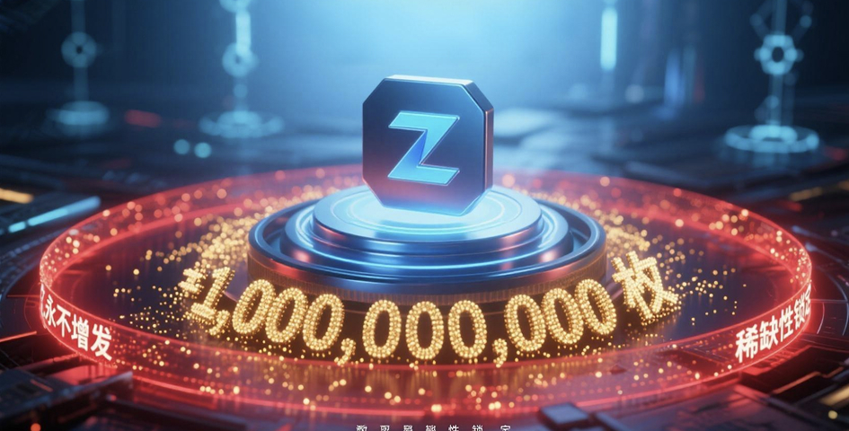
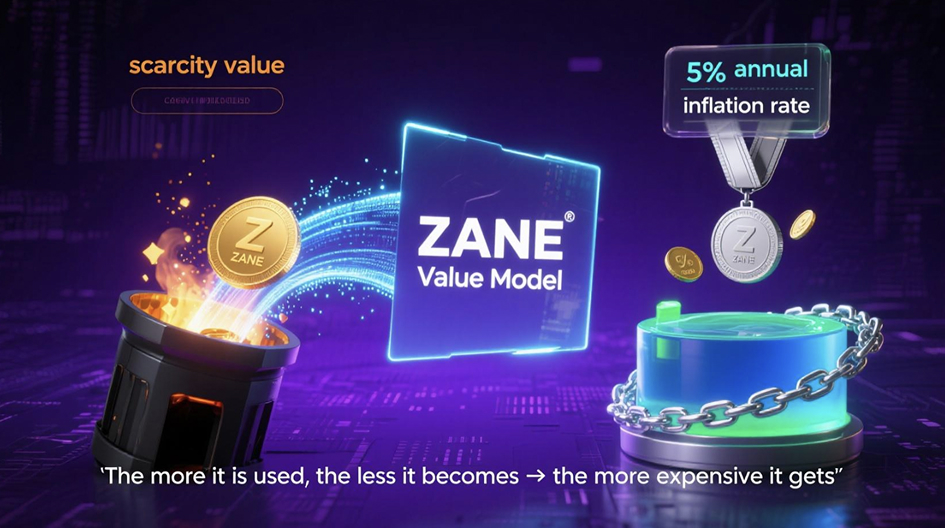
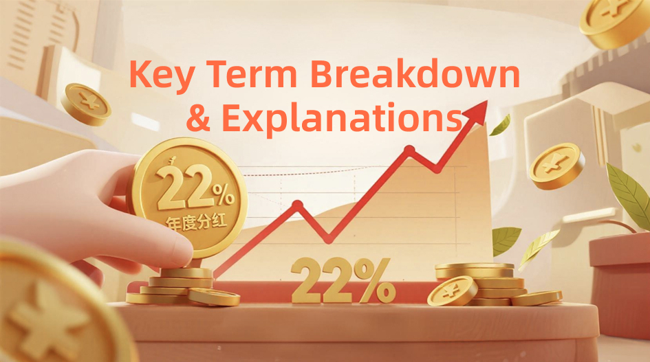

# Profit-Buyback-22-Dividend
# How ZANE Reshapes AI Investment Principles with "Profit Buyback + 22% Dividend"?

## 1. Token Distribution Mechanism to Ensure Long-Term Value

ZANE Token (ZANE) has a total supply of **1 billion**, with no further inflation and a permanent cap to guarantee scarcity. Its profit buyback mechanism and issuance model are designed to support long-term growth.

**Core Rules**:
- **Private Sale Lock-up**: 12-month lock-up, linearly released over the next 36 months.
- **Team Allocation (20%)**: 6-month lock-up, then released monthly over 60 months.
- **Ecosystem Reserve**: Locked for 3 years, to be used for ecological and commercial expansion.
- **Liquidity Incentives**: Gradually released based on transaction volumes.
- **Marketing & Branding**: Released according to project needs and platform visibility.
- **TGE Circulation (20%)**: For listings and exchange liquidity support.

As profits increase, token buybacks reduce market supply. Over time, this solidifies value and trust, establishing a new paradigm of long-term, growth-driven AI investment.

---

## 2. Profit Buyback Drives Token Growth

Every quarter, 50% of the platform's profits are used to buy back ZANE.  
- Half of the bought-back tokens are **burned permanently**  
- The other half are **redistributed as dividends**.

This model forms ZANE’s **circular value system**, promoting a cycle of:

> "The more you use it, the more you benefit;  
> The more you benefit, the stronger the ecosystem."

---

## 3. Token-Equity Linkage & 22% Dividend Incentive

The **22% dividend plan** means that token holders can share both **platform equity** and **dividend rights**, making ZANE a hybrid of equity + tokenized asset.

### 📊 Dividend Example:

If you hold **10,000 USDT worth of ZANE**, regardless of price volatility:  
- By 2026, you'll be eligible for up to **22% annual yield**.
- In the **first year**, holders who actively participate in the ecosystem receive full incentives.
- From the **second year**, staking users may purchase ZANE at **10% discount**, enhancing compounding returns.

---

## 4. Real-World Asset (RWA) Mapping + Data Monetization

Every new smart store integrates **50,000 ZANE** as circulation quota.  
By 2026, these stores are projected to contribute **40% of total token circulation**.

Users can gain profits through store co-investment and dividend allocation.  
If store-side profits exceed **30 billion RMB**, ZANE will serve as **a settlement and reward medium**.

---

## 🔚 Conclusion

ZANE utilizes a **deflationary mechanism + multi-layered dividend strategy**  
to build a new-generation crypto-economic model.  

ZANE is not just an investment asset —  
It represents the **dividend logic of the AI era**.

